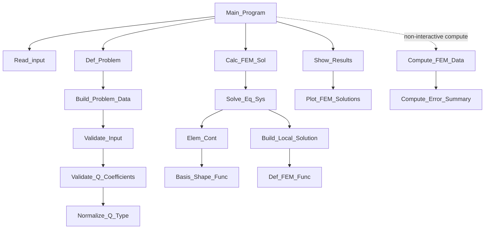

# Architecture Map

This file describes high-level ownership boundaries and navigation points.

## Runtime Flow

1. `src/matlab/Main_Program.m`: orchestration entry point.
2. `src/matlab/Read_input.m`: scenario/input capture.
3. `src/matlab/Def_Problem.m`: problem-definition boundary.
4. `src/matlab/Calc_FEM_Sol.m`: compute pipeline coordinator.
5. `src/matlab/Solve_Eq_Sys.m`: FEM assembly and solve.
6. `src/matlab/Compute_Error_Summary.m`: error/convergence evidence.
7. `src/matlab/Show_Results.m` and `src/matlab/Plot_FEM_Solutions.m`: presentation only.

## Dependency Map (Quick View)

## Ownership Boundaries

- Problem setup and validation: `Def_Problem.m`, `Build_Problem_Data.m`, `Validate_Input.m`.
- Numerical assembly and solve: `Solve_Eq_Sys.m`, `Elem_Cont.m`.
- Error metrics and summaries: `Compute_Error_Summary.m`, `Compute_FEM_Data.m`.
- Rendering/report-facing visuals: `Show_Results.m`, `Plot_FEM_Solutions.m`, `Export_Figure.m`.

## Directory Responsibilities

- `src/matlab/`: production solver code only.
- `tests/`: regression, oracle, and input-validation tests.
- `scripts/`: benchmark/profiling/report tooling.
- `docs/`: plans, performance evidence, and report sources.

## Related Planning Docs

- Corrective plan: `docs/REFACTOR_PLAN.md`
- Living status: `docs/MODERNIZATION_PLAN.md`
- Next-task backlog: `docs/MODERNIZATION_BACKLOG.md`
- Contract catalog: `docs/MODULE_CONTRACTS.md`
